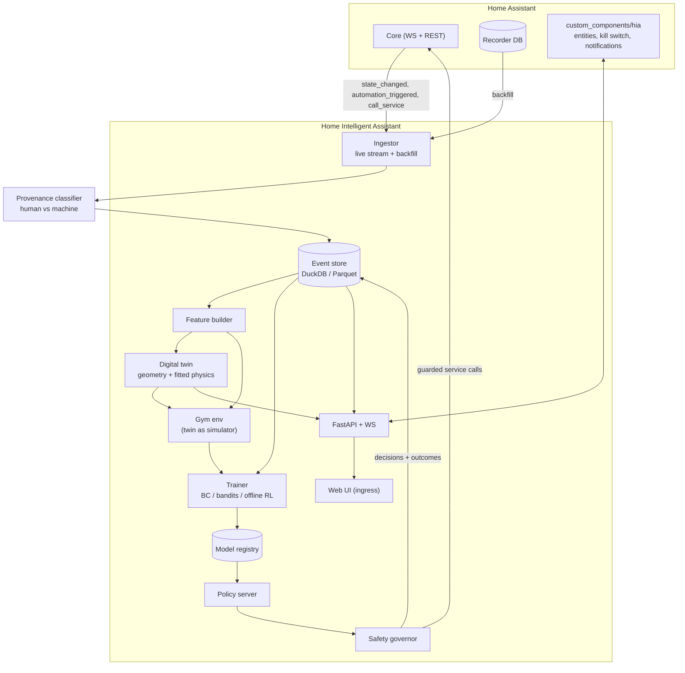

# Architecture

## System shape



## Components

### `ha/` — Home Assistant client

- WebSocket client with auth, resubscribe-on-reconnect, backpressure, and a
  monotonic event sequence so gaps are detectable.
- Subscriptions: `state_changed`, `call_service`, `automation_triggered`,
  `homeassistant_start` / `homeassistant_stop`.
- Registry sync: entity, device, area, floor and label registries. Areas and floors
  are the skeleton of the twin.
- REST for `/api/services`, `/api/config`, `/api/template`.
- **Recorder reader**: read-only connection to the recorder DB (SQLite / MariaDB /
  Postgres) for backfill. Modern schemas normalise `entity_id` out into
  `states_meta`, and long-term rollups live in `statistics` / `statistics_short_term`
  keyed by `statistics_meta`. The reader must detect `schema_version` and adapt, and
  must never write. The History REST API is the fallback when the DB is unreachable,
  but it is far too slow for months of data.

### `ingest/` — event capture and storage

- Append-only event log. **DuckDB + partitioned Parquet** is the default: embedded,
  no extra container, excellent for the analytical scans training needs, cheap to
  ship inside an add-on. TimescaleDB is an optional backend for large installs.
  In practice this is a two-tier design: DuckDB's own file is the live, authoritative
  append target (simple, transactional, no file-rotation logic to get wrong); the
  partitioned-Parquet side is produced on demand as frozen training snapshots
  (docs/06-model-training.md §1's `dataset_id` mechanism), not written on the live
  path. Two tables: `state_changes` (typed — the dominant, heavily-queried event) and
  `events` (generic JSON `data`, for automation_triggered/script_started/call_service
  and anything else, interpreted later by provenance). Built in P1; see
  docs/HANDOFF.md for the concrete schema.
- Backfill replays recorder history into the same schema, so live and historical
  data are indistinguishable downstream. (Not yet built as of P1's first slice —
  live ingestion landed first because it starts a clock that backfill doesn't.)
- Data quality report: entities with no history, sensors that flap, units that
  change mid-series, gaps in the stream. V1 (P1) covers no-history/stale entities and
  gap detection via the reconnect flag every row carries; flapping/unit-change
  detection is deferred to P4, once there's real data to calibrate "flapping" against.

### `features/` — turning a heterogeneous house into tensors

The least glamorous and most important module.

- Per-domain encoders: binary sensors, numeric sensors (with unit normalisation),
  climate, light (on/off, brightness, colour temp), media, covers, person and
  device_tracker.
- Temporal features: sin/cos time-of-day and time-of-year, day-of-week, holiday
  flag, solar elevation and azimuth, minutes since last motion per area, time since
  last manual interaction per entity.
- Weather and tariff joins, taken from HA's own weather and energy integrations.
- **Inferred occupancy**: a per-area latent state estimated from motion, door,
  power-draw and device_tracker evidence. Almost no house has ground truth here, so
  this is a filter whose output is a probability, carried downstream as a
  distribution rather than collapsed to a boolean.
- A stable, versioned feature schema. Models are useless if the observation vector
  silently changes shape the day a new device is paired.

### `provenance/` — who caused this?

Sits between ingestion and every reward calculation. Classifies each state change as
human (physical / UI / voice), machine (HA automation / external automation /
device-local), our own action, or unknown — and only human-caused events are allowed to
generate reinforcement.

Three layers: context-chain resolution, automation-fire correlation against parsed
automation and Node-RED targets, and per-actor account classification. Unknowns abstain
rather than contributing a zero. It also computes each entity's `automation_share`,
which gates whether a decision point is created at all.

This module is a hard dependency of automated reinforcement and is specified in full in
[05-provenance.md](05-provenance.md).

### `twin/` — the digital twin

Three jobs, one object: **simulator**, **explanation surface**, **model health check**.

- *Topology*: areas become rooms, entities are placed in rooms. Derived
  automatically from the area registry.
- *Geometry*: HA does not know your floorplan, so the UI provides a 2D polygon
  editor — draw rooms, drag entities onto them, mark wall adjacency. Optional
  background image import for tracing. Fallback auto-layout infers **room adjacency
  from motion-sensor trigger co-occurrence**: rooms whose motion sensors fire in
  quick succession are probably connected.
- *Physics*: per-zone thermal RC network (capacitance, conductance to neighbours and
  to outside, solar gain, HVAC input) fitted by least squares against recorder
  history. Plus simple illuminance and humidity models.
- *Behaviour*: the occupancy and behaviour-cloning models supply the "human" inside
  the simulation.
- *Health*: rolling predicted-vs-actual error per zone. If the twin drifts, policies
  trained inside it are suspect, and the UI has to say so.

### `envs/` — Gymnasium environments

- `HouseEnv` steps the twin, exposes the observation schema, applies the reward.
- `ReplayEnv` steps over logged real history for offline evaluation and for
  measuring shadow-mode agreement. Same interface, no counterfactual dynamics.

### `policies/` — the learners

See [03-learning.md](03-learning.md). Every policy implements one interface:

```
propose(observation) -> Proposal{action, propensity, value_estimate, explanation}
```

Baselines — do-nothing, existing-HA-automations, fixed schedule, behaviour clone —
are first-class policies, so they appear in every comparison automatically.

### `governor/` — the thing that makes this safe to install

Nothing reaches a service call without passing through here.

- **Autonomy ladder**, per entity or per decision point:
  `off → observe → suggest → act-with-undo → autonomous`.
- **Hard constraints**, coded and not learned: temperature floor and ceiling, quiet
  hours, permanent denylist (locks, alarm, garage, water shutoff, medical), max
  actions per hour per entity, no action within N seconds of a manual interaction.
- **Global kill switch** exposed as an HA `input_boolean`, so it can be hit from a
  dashboard, a voice assistant, or a wall tablet.
- **Deadman**: the governor heartbeats into HA. If the heartbeat goes stale, HA-side
  automations resume and nothing stays latched.
- **Full decision log**: policy id, model version, observation hash, action,
  propensity, predicted value, counterfactual, reversibility, and what happened next.

### `train/` — jobs, evaluation, registry

- Scheduled retraining, versioned model artefacts, and an offline policy evaluation
  harness (importance sampling plus doubly-robust estimates) run against logged
  propensities.
- A model is promotable only if it beats both the incumbent and the relevant
  baselines on that harness.

### `api/` + `ui/` — FastAPI and React

- FastAPI serves REST plus a WebSocket for live push. Under ingress it must honour
  `X-Ingress-Path` for base-URL rewriting, listen on the declared ingress port, and
  refuse connections that do not originate from the Supervisor (`172.30.32.2`).
- React + TypeScript + Vite + Tailwind. Panels:
  - **Overview** — autonomy state, today's decisions, reward components, alerts.
  - **Twin** — 2D floorplan (3D later) with live states, occupancy heat, predicted
    vs actual temperature, and the model's attention for the current decision.
  - **Decisions** — timeline of proposals and actions, each with an explanation, the
    counterfactual, and thumbs up/down that feeds straight back into the reward.
  - **Learning** — training curves, offline evaluation, baseline comparison, twin
    drift, data quality.
  - **Entities** — per-entity autonomy level, denylist, exploration budget.
- 3D uses react-three-fiber, extruding the same 2D polygons. The 2D floorplan stays
  the source of truth; 3D is a view of it, never a second model.

### `custom_components/hia/` — the HA-side integration

- Publishes the system's own state back into HA as entities: reward over 24h,
  override rate, twin drift, model version, per-decision-point autonomy `select`
  entities, and the global kill switch.
- Fires events (`hia_decision`, `hia_action`) so users can build ordinary
  automations on top.
- Actionable notifications for `suggest` mode, with accept and reject buttons —
  the highest-quality reward signal the system will ever get.
- Required for HA Container users; useful for everyone.

## Repository layout

```
addon/
  hia/                config.yaml, Dockerfile, build.yaml, s6 rootfs, translations
  repository.yaml
custom_components/hia/
backend/src/hia/
  ha/  ingest/  provenance/  features/  twin/  envs/  policies/  governor/  train/  api/  cli.py
frontend/             vite + react + ts
docs/
tests/
compose.yaml          standalone (non-add-on) deployment
```

## Stack

| Layer | Choice | Why |
|---|---|---|
| Language | Python 3.13, `uv` | HA ecosystem is Python; uv keeps the Docker build fast |
| Web | FastAPI + Pydantic v2 | async, matches a WebSocket-heavy workload |
| Storage | DuckDB + Parquet (Timescale optional) | embedded, analytical, no second container |
| ML | PyTorch (CPU), Gymnasium, Stable-Baselines3, d3rlpy | CPU-only is a hard requirement |
| Frontend | React, TS, Vite, Tailwind, ECharts, react-three-fiber | ECharts for dense metrics, R3F for the 3D twin |
| Quality | ruff, mypy, pytest, pytest-asyncio | |
| Packaging | multi-stage Docker on `ghcr.io/home-assistant/{arch}-base-python`, s6-overlay | the standard for HA add-ons |
