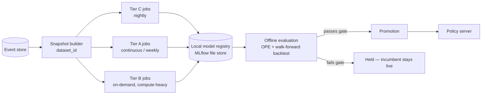

# Model training and development plan

[03-learning.md](03-learning.md) says *what* to learn and why the naive framing fails.
This document says *how each model actually gets built*: data pipeline, per-model
specs, compute budget, experiment tracking, evaluation protocol, and the tests that
keep an ML pipeline from failing silently — which is the normal way ML pipelines fail.

Nothing here is implemented yet. This is the plan P4 onward builds against.

---

## 1. Training data pipeline

### Snapshots, not live queries

A model is never trained against the live event store. Training reads a **frozen
snapshot**: an extraction of `[start, end)` from the store, tagged with

```
dataset_id = hash(time_range, feature_schema_version, provenance_filter_version)
```

Freezing matters for a reason specific to this project: the provenance filter (which
events count as human) and the feature schema both change as the classifier improves.
If two models are compared, they must be compared on the *same* interpretation of the
past, or "model B is better" may just mean "model B was scored on a cleaner filter."
Every training run logs its `dataset_id`; re-running a run must reproduce the same
dataset byte-for-byte.

### Splits are temporal, never random

k-fold and random train/test splits are wrong here for two independent reasons: house
data is autocorrelated at short lag (this hour looks like last hour), so a random split
leaks the answer across the train/test boundary; and the actual goal is generalising
**forward in time**, not backward, since occupant habits and seasons drift.

Standard split, applied identically everywhere:

```
train:      oldest 70% of the snapshot window
validation: next 15%                      (model selection, early stopping)
test:       most recent 15%, held out      (reported metric, touched once)
```

Sequential RL and offline policy evaluation additionally use **walk-forward**
backtesting rather than a single split: train on weeks 1–8, evaluate week 9; slide the
window forward and repeat. A single lucky test window is not evidence.

### Leakage is a lint rule, not a code review hope

Every column the feature builder produces carries the timestamp of the information it
was computed from. CI runs an automated check that walks this provenance and fails the
build if any feature's source timestamp can postdate the decision timestamp it is
attached to. This catches the single most common and most silent bug class in this
kind of project — a feature that is technically available in the historical table but
would not have been available yet at decision time (e.g. an end-of-day aggregate joined
onto a morning row).

### Minimum data before a model is attempted

Training on too little data does not fail loudly, it produces a confident-looking model
that is actually noise. Each model class has an explicit floor, below which training is
skipped and the baseline is served instead:

| Model | Floor | Rationale |
|---|---|---|
| Occupancy filter (per area) | 14 area-days of motion/door evidence | Enough to see a full weekly cycle |
| Thermal RC fit (per zone) | 10 days spanning a ≥5 °C outdoor swing | RC parameters are unidentifiable without excitation |
| Behaviour cloning | 500 provenance-verified human actions | Below this, a persistence baseline wins anyway |
| Contextual bandit (per decision point) | 5 effective human events/week ([05-provenance.md](05-provenance.md) §6) | Same floor that gates admission; training and acting share one threshold |
| Sequential RL (simulation) | Thermal RC model passing its own gate, below | Sim-trained policies are only as good as the sim |
| Offline RL (real logs) | 4 weeks of propensity-logged decisions | IQL/CQL need enough logged action diversity to avoid extrapolating into unseen actions |

---

## 2. Per-model specifications

### Tier C — supervised, ships first because everything else depends on it

**Thermal RC network (per zone).** Grey-box, not a black-box net: capacitance `C`,
conductances to neighbouring zones and outside `R_ij`, a solar-gain coefficient, and an
HVAC input term. Fit by nonlinear least squares (`scipy.optimize.least_squares`) against
the zone's actual temperature trace, with outdoor temp, solar elevation, and HVAC
on/off/mode as exogenous inputs. Chosen over a learned black-box model because (a) 10
days of data cannot identify a deep model, (b) the parameters are physically
interpretable and can be sanity-checked (a conductance should not come out negative),
and (c) the twin needs to *simulate forward*, not just predict one step.

Validation metric is **6-hour rollout RMSE**, not 1-step RMSE. A 1-step model can look
excellent and still diverge badly over the horizon Tier B actually plans across, because
1-step error does not penalise compounding drift. Target from [04-roadmap.md](04-roadmap.md)
P5: under ~0.5 °C over 6 hours in the main living zones. Golden-file regression test:
fixed synthetic RC network + synthetic trace → recovered parameters within tolerance,
so a library upgrade that silently changes optimizer behaviour is caught in CI, not in
production.

**Occupancy filter (per area).** A per-area Hidden Markov Model over a small discrete
state (empty / occupied, extendable to occupied-active / occupied-idle), with emissions
from motion, door, power draw and device_tracker evidence. Chosen over a supervised
classifier because **there is no ground-truth label anywhere in this problem** — nobody
tags "someone was in the kitchen at 14:32" — so the forward-backward algorithm's
unsupervised posterior is the whole tool. Output is always a probability, carried
downstream as a distribution; nothing downstream is allowed to silently collapse it to
a boolean. Validated primarily by proxy (does using it as a bandit feature improve
realised reward vs. a naive motion-recency feature); a household willing to hand-log a
few days of actual presence provides a direct validation set but is never required.

**Behaviour cloning (next-action prediction).** Gradient-boosted trees (LightGBM),
not a neural network, as the first model. The data regime is small-to-medium and
tabular, GBTs train in seconds on a CPU, and per-feature importances feed directly into
the explainability panel ([02-architecture.md](02-architecture.md) UI section) for free.
An MLP/small-transformer upgrade is only justified past ~6 months of history and
50,000+ provenance-verified labelled transitions — track this threshold, do not reach
for the bigger model early because it seems more "ML."

**Arrival / occupancy-transition prediction.** Quantile regression (LightGBM in
quantile mode) over historical arrival patterns and device_tracker distance-to-home,
producing a *distribution* over arrival time rather than a point estimate. A point
estimate silently discards the uncertainty that Tier B pre-heating decisions actually
need.

### Tier A — contextual bandits

**Context vector is small on purpose.** Bandit regret scales with context
dimensionality, and early data volume is the whole constraint here, so the bandit's
input is a curated 20–40 dimensional slice of the full feature vector (time encoding,
occupancy probability, illuminance, recency-since-last-manual-interaction) — not the
full observation the twin and Tier B models see. Feature selection happens once,
offline, before the bandit is wired in.

**Algorithm progression:** LinUCB or Thompson Sampling over a linear reward model
first. A neural or kernelised bandit is a later upgrade, justified only once a decision
point has enough volume that the linear model's bias is visibly the bottleneck (watch
the offline-eval gap between the linear bandit and a supervised upper bound on the same
data).

**Exploration is deliberately conservative**, not tuned for fastest regret
minimisation. The exploration parameter is set to favour exploitation, and exploration
itself is bounded by the governor's autonomy ladder — a bandit at `observe` or
`suggest` can propose whatever it likes because nothing acts on it yet; only once
promoted to `act-with-undo` does its exploration budget become a real product
constraint, at which point it is capped explicitly (max unforced/low-confidence actions
per day), independent of whatever the bandit's internal exploration parameter would
otherwise choose.

**Cold start:** below the 5 effective-events/week floor, the bandit does not propose at
all — the baseline (existing automation, or do-nothing) is served, and the bandit trains
silently in the background against accumulating data until it clears the floor.

### Tier B — sequential RL, simulation-trained

**Environment.** `HouseEnv` (Gymnasium) wraps the twin: `step()` integrates the RC
network and behaviour models one timestep, `reward()` calls the *exact same function*
production uses to score real outcomes — imported, never reimplemented — so a
sim/production reward mismatch cannot silently creep in as two copies drift apart.
`check_env` from Gymnasium's own test utilities runs in CI against every twin change.

**Simulation training.** SAC for continuous actions (HVAC setpoint), PPO where the
action is naturally discrete (water heater on/off schedule), via Stable-Baselines3 —
actively maintained, CPU-friendly, and the twin's step cost is cheap (an RC-network
integration, not a rendered simulation), so it vectorises well.
Budget: **target under 4 hours wall-clock per training run** on a 4-core box, using
`SubprocVecEnv` to parallelise environment steps across cores, with checkpointing so an
interrupted run resumes rather than restarting.

**Offline RL on real logs.** IQL via d3rlpy, trained directly on logged real
transitions (propensity-logged from day one — see the roadmap's list of things that
cannot be retrofitted). IQL over CQL as the default because it is more conservative
about extrapolating into actions the logged policy rarely took, which matters more here
than squeezing out extra performance. This model is **not primarily meant to be
deployed** — its job is to be a check on the simulator: if IQL's estimate of the best
policy disagrees sharply with what the sim-trained SAC/PPO policy claims, the twin is
untrustworthy and that policy does not get promoted, full stop. This is the same twin-
drift gate already in [04-roadmap.md](04-roadmap.md) P5, made concrete here as a
promotion-blocking check rather than a dashboard number.

---

## 3. Training pipeline



### Scheduling and resource budget

Training runs on the same box that is running the house, which is a real constraint
this project cannot wave away. Jobs are scheduled, not on the request path:

- **Tier C:** nightly, cheap (seconds to low minutes per model).
- **Tier A:** bandit parameter updates are incremental and near-free; a full feature-
  selection refresh runs weekly.
- **Tier B simulation training:** on-demand, not scheduled by default — triggered
  manually or by a drift alarm, because it is the only training job expensive enough to
  matter. Capped to *N − 1* cores (never all of them — Home Assistant itself and the
  governor's inference loop need the last one) and to an explicit memory ceiling,
  enforced by running it as a subprocess with resource limits rather than trusting the
  training code to behave. A runaway training job is not allowed to be the reason the
  house stops responding.

### Experiment tracking and the model registry

Local-only rules out any cloud experiment tracker. **MLflow in local file-store mode**
(`file:` tracking URI onto the add-on's persistent volume) gives run tracking and a
model registry with no server process to run inside an already resource-constrained
container. Every run logs: `dataset_id`, feature-schema version, the git commit the
training code ran at, hyperparameters, training curves, and the full offline-evaluation
scorecard against every baseline. This is the concrete storage behind the promise in
[03-learning.md](03-learning.md) that a policy losing to baselines is reported, not
buried — the scorecard is what the UI's Learning panel reads directly.

Versioning per decision point: `{decision_point}-v{N}`, N monotonic, immutable once any
real decision has been logged against it. The last several promoted versions stay on
disk; rollback to a prior version is a manual, logged action, distinct from the
governor's automatic ladder demotion.

---

## 4. Evaluation protocol

Extends [03-learning.md](03-learning.md) §Evaluation with the actual mechanics.

**Offline policy evaluation** uses importance sampling and doubly-robust estimators
against logged propensities, and **effective sample size (ESS) is a promotion gate, not
just a display number** — an estimate built on an ESS below the floor is refused
promotion outright, the same way the provenance doc refuses to enable a decision point
below its effective-events floor. A confident-looking OPE estimate from a
near-deterministic logging policy is worse than no estimate, because it is wrong in a
way that looks trustworthy.

**A/B significance accounts for autocorrelation.** A house is one autocorrelated time
series, not a bag of i.i.d. events, so naive per-decision-level significance tests
overstate confidence. A/B comparisons run as paired day-alternation (policy-on days vs.
policy-off days), aggregated to one number per day, compared with a block bootstrap or
a paired Wilcoxon signed-rank test over daily aggregates — never a t-test over raw
events.

**Promotion checklist**, all required, autonomy ladder rung advances one step at a
time even after all four pass:

1. Offline evaluation shows new ≥ incumbent with a confidence interval excluding zero
   improvement, at adequate ESS.
2. Shadow-mode agreement measured for at least two weeks.
3. For Tier B: twin-drift / offline-RL-disagreement check (§2) below threshold.
4. Zero hard-constraint violations in evaluation — this one has no confidence interval,
   it is pass/fail.

---

## 5. Testing the ML pipeline itself

Ordinary unit tests catch ordinary bugs. These catch the ones specific to a pipeline
that can fail by quietly producing a plausible-looking wrong answer:

- **Leakage lint** (§1) in CI on every change to the feature builder.
- **`check_env`** on `HouseEnv` before any training run is allowed to start.
- **Golden-file regression** on the thermal RC fitter: fixed synthetic input, expected
  parameters within tolerance — catches a library upgrade silently changing optimizer
  behaviour.
- **Provenance fixture tests** with known ground truth for the two cases already proven
  to be traps in [05-provenance.md](05-provenance.md): a sun-triggered automation (no
  context, must not be misread as a human) and a Node-RED action (`user_id` present,
  must not be misread as human). These run in CI specifically so a future refactor
  cannot silently reopen either hole.
- **Reward-function identity test**: asserts the simulation environment and the
  production reward pipeline are calling the *same* function object, not two
  implementations that merely started out matching.

---

## 6. What this doc deliberately does not cover

Hyperparameter search is intentionally not specified in detail. With no cloud compute
and small datasets, the plan is sane documented defaults per model (noted inline above)
plus narrow manual sweeps when a specific model underperforms its gate — not a search
infrastructure. If a model needs serious tuning to clear its bar, that is itself a
signal the model choice is wrong for the data volume available, worth revisiting before
reaching for a tuning framework.
